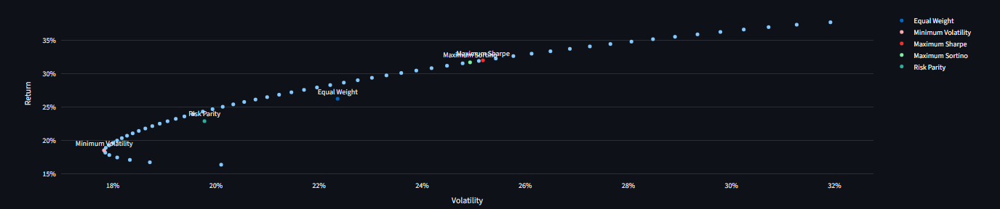
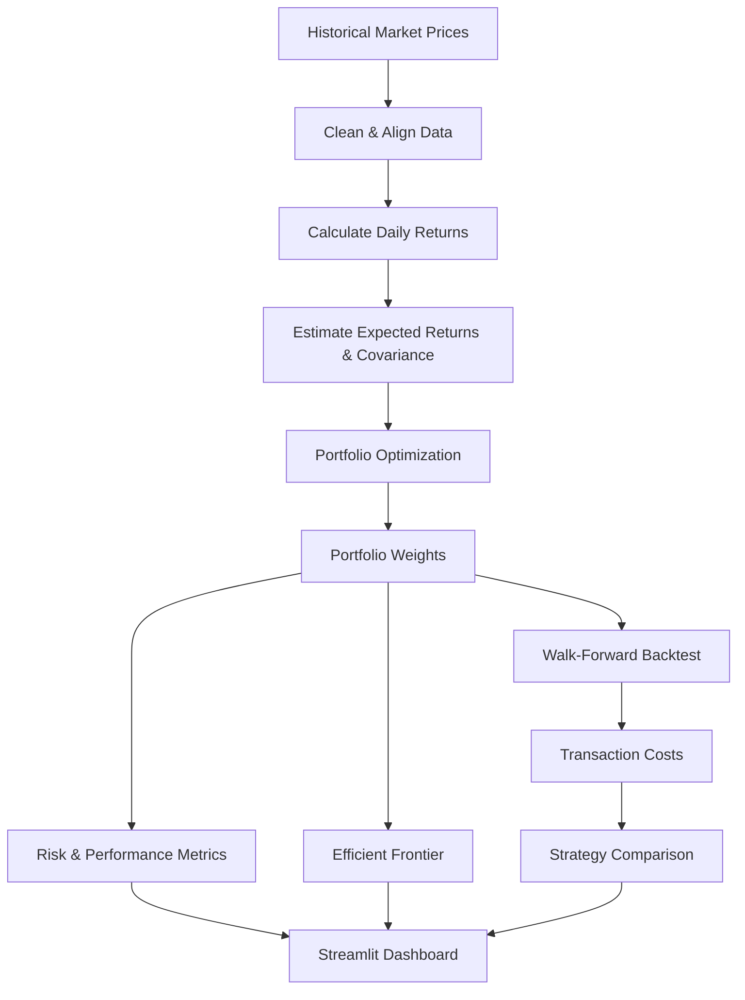
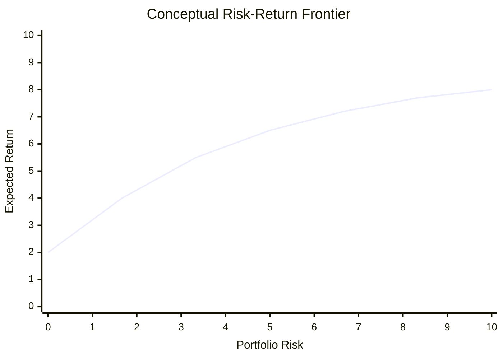
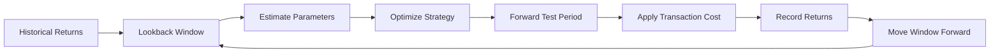

<div align="center">

# Portfolio Optimization & Risk Management System
### *Data-driven portfolio construction, risk analysis, and walk-forward backtesting*

**An interactive quantitative portfolio analytics platform built with Python and Streamlit.**  
Construct optimized portfolios, analyze risk, visualize the efficient frontier, and compare strategies through out-of-sample backtesting.


</div>

---

## Table of contents

- [About](#about)
- [Features](#features)
- [Dashboard](#dashboard)
- [Workflow](#workflow)
- [Portfolio optimization](#portfolio-optimization)
- [Risk & performance metrics](#risk--performance-metrics)
- [Walk-forward backtesting](#walk-forward-backtesting)
- [Tech stack](#tech-stack)
- [Project structure](#project-structure)
- [Getting started](#getting-started)
- [Usage](#usage)
- [Testing](#testing)
- [Results](#results)
- [License](#license)

---

## About

This project is an end-to-end **portfolio optimization and risk management system** designed to move from historical market data to portfolio construction, risk evaluation, and out-of-sample strategy testing.

The application uses historical price data to calculate asset returns, estimate expected returns and covariance, optimize portfolio weights under allocation constraints, and evaluate the resulting strategies using both return and downside-risk measures.

The Streamlit dashboard allows users to change the portfolio universe, date range, maximum asset weight, risk-free rate, and transaction costs without changing the underlying code.

### The system combines

- Historical market-data retrieval
- Return and covariance analysis
- Constrained portfolio optimization
- Minimum-volatility allocation
- Maximum-Sharpe allocation
- Maximum-Sortino allocation
- Risk-parity allocation
- Efficient-frontier analysis
- Portfolio risk and performance metrics
- Transaction-cost-aware backtesting
- Walk-forward out-of-sample evaluation
- Interactive visualizations

---

## Features

| | |
|---|---|
| 📈 **Market data** | Downloads historical adjusted price data using `yfinance`. |
| 🧮 **Return analysis** | Converts prices into daily returns and annualized statistics. |
| ⚖️ **Minimum Volatility** | Finds a constrained portfolio with minimum portfolio volatility. |
| 🎯 **Maximum Sharpe** | Optimizes the portfolio for risk-adjusted return using the Sharpe ratio. |
| 📉 **Maximum Sortino** | Optimizes using downside deviation instead of total volatility. |
| 🔄 **Risk Parity** | Builds a portfolio that balances risk contribution across assets. |
| 📊 **Efficient Frontier** | Generates a constrained return-volatility frontier and overlays portfolio solutions. |
| 🛡️ **Risk analysis** | Measures volatility, drawdown, VaR, CVaR, Sortino, and Calmar ratios. |
| 💰 **Transaction costs** | Deducts trading costs based on portfolio turnover during backtesting. |
| 🧪 **Walk-forward testing** | Optimizes on a historical training window and evaluates on a later test window. |
| 🖥️ **Interactive dashboard** | Provides portfolio tables, metrics, charts, and strategy comparisons in Streamlit. |
| ✅ **Unit tests** | Tests core optimization and portfolio-metric functions with pytest. |

---

## Dashboard

The application is designed as a single interactive Streamlit dashboard.

### Dashboard layout

```text
┌───────────────────────────────────────────────────────────────┐
│          📈 Portfolio Optimization & Risk Management          │
├───────────────────┬───────────────────────────────────────────┤
│ Market Setup      │ Optimized Portfolio Allocations           │
│                   │                                           │
│ • Tickers         │ Equal Weight / Min Vol / Max Sharpe      │
│ • Start date      │ Max Sortino / Risk Parity               │
│ • End date        │                                           │
│ • Max weight      ├───────────────────────────────────────────┤
│ • Risk-free rate  │ Portfolio Metrics                         │
│ • Transaction cost│ Return | Volatility | Sharpe | Drawdown │
│                   ├───────────────────────────────────────────┤
│ [Run Analysis]    │ Efficient Frontier                        │
│                   │                                           │
│                   ├───────────────────────────────────────────┤
│                   │ Walk-Forward Backtest                     │
│                   │ Metrics | Cumulative Wealth | Risk       │
└───────────────────┴───────────────────────────────────────────┘
```

### Recommended screenshots

Add screenshots generated from the actual Streamlit application to `docs/assets/` and use them here:

<p align="center">
  
</p>

<p align="center">
  
</p>

<p align="center">
  
</p>

<p align="center">
  
</p>

> The image paths above are intentionally organized for a GitHub repository. Capture the corresponding charts from the running dashboard and save them under `docs/assets/` before publishing the README.

---

## Workflow



---

## Portfolio optimization

The system constructs and compares five portfolio strategies.

### Equal Weight

Every asset receives the same allocation:

$$
w_i = \frac{1}{N}
$$

This provides a simple benchmark against which optimized strategies can be evaluated.

### Minimum Volatility

The optimizer minimizes portfolio variance subject to the portfolio constraints:

$$
\min_w \quad w^T\Sigma w
$$

where:

- $w$ = portfolio-weight vector
- $\Sigma$ = annualized covariance matrix

### Maximum Sharpe

The Sharpe ratio is defined as:

$$
Sharpe = \frac{R_p-R_f}{\sigma_p}
$$

The optimization searches for the portfolio with the strongest return relative to total volatility.

### Maximum Sortino

The Sortino approach focuses on **downside deviation** rather than penalizing all volatility.

$$
Sortino = \frac{R_p-R_f}{Downside\ Deviation}
$$

### Risk Parity

Risk parity attempts to distribute portfolio risk more evenly among the assets rather than allocating capital purely according to expected returns.

### Portfolio constraints

The optimization engine supports:

- Fully invested portfolios: $\sum w_i = 1$
- Long-only weights: $w_i \ge 0$
- Maximum allocation per asset
- Feasibility checks before optimization
- SLSQP-based constrained optimization through SciPy

---

## Efficient frontier

The application calculates a **constrained efficient frontier** and overlays the main portfolio solutions on the return-volatility plane.



> The chart above is a conceptual README visualization. The Streamlit application calculates the actual frontier from the selected assets, dates, expected returns, covariance matrix, and maximum-weight constraint.

The dashboard also marks:

- Equal Weight
- Minimum Volatility
- Maximum Sharpe
- Maximum Sortino
- Risk Parity

---

## Risk & performance metrics

The project evaluates portfolio performance using several complementary measures.

| Metric | Description |
|---|---|
| **CAGR / Annualized Return** | Annualized growth rate of the portfolio over the evaluation period. |
| **Volatility** | Annualized standard deviation of portfolio returns. |
| **Sharpe Ratio** | Excess return per unit of total volatility. |
| **Sortino Ratio** | Excess return per unit of downside deviation. |
| **Maximum Drawdown** | Largest peak-to-trough decline in portfolio wealth. |
| **VaR 95%** | Historical loss threshold at the 95% confidence level. |
| **CVaR 95%** | Average loss in the worst 5% historical observations. |
| **Calmar Ratio** | Annualized return relative to maximum drawdown. |

### Portfolio volatility

$$
\sigma_p = \sqrt{w^T\Sigma w}
$$

### Maximum drawdown

The application builds a cumulative wealth series and compares each observation with its running peak:

$$
Drawdown_t = \frac{V_t}{Peak_t}-1
$$

The maximum drawdown is the minimum value of the resulting drawdown series.

---

## Walk-forward backtesting

The backtesting engine uses a **rolling training window** and a forward test period.



### Backtest configuration

The application uses:

- A historical lookback window
- Periodic rebalancing
- Five portfolio strategies
- Configurable risk-free rate
- Configurable maximum asset weight
- Configurable transaction costs

Transaction costs are calculated from portfolio turnover:

$$
Cost = \sum_i |w_{i,new}-w_{i,old}| \times \frac{Cost_{bps}}{10000}
$$

The cost is applied to the first return observation of each forward testing period.

### Strategies compared

```text
Equal Weight
Minimum Volatility
Maximum Sharpe
Maximum Sortino
Risk Parity
```

The resulting strategies are compared using the project's performance and risk metrics and through an out-of-sample cumulative-wealth chart.

---

## Tech stack

| Layer | Technology |
|---|---|
| Language | Python 3.10+ |
| Dashboard | Streamlit |
| Data manipulation | Pandas |
| Numerical computing | NumPy |
| Optimization | SciPy `optimize.minimize` / SLSQP |
| Market data | yfinance |
| Visualization | Plotly |
| Testing | pytest |

### Dependencies

```text
numpy>=1.26
pandas>=2.2
scipy>=1.13
yfinance>=0.2.40
streamlit>=1.36
plotly>=5.22
pytest>=8.0
```

---

## Project structure

```text
portfolio_optimization_risk_system/
├── app.py                         # Streamlit dashboard and application flow
├── requirements.txt               # Python dependencies
├── data/
│   └── .gitkeep                   # Placeholder for local data
├── src/
│   ├── __init__.py
│   ├── data.py                    # Market-data download and return preparation
│   ├── optimization.py             # Portfolio optimization strategies
│   ├── risk.py                     # Portfolio risk calculations
│   ├── metrics.py                  # Performance and risk metrics
│   └── backtest.py                 # Walk-forward backtesting engine
└── tests/
    ├── test_metrics.py             # Metric unit tests
    └── test_optimization.py         # Optimization unit tests
```

---

## Getting started

### Prerequisites

- Python 3.10 or newer
- `pip`
- Internet connection for downloading market data from Yahoo Finance

### 1. Clone the repository

```bash
git clone <your-repository-url>
cd portfolio_optimization_risk_system
```

### 2. Create a virtual environment

#### Windows

```bash
python -m venv venv
venv\Scripts\activate
```

#### macOS / Linux

```bash
python3 -m venv venv
source venv/bin/activate
```

### 3. Install dependencies

```bash
pip install -r requirements.txt
```

### 4. Run the application

```bash
streamlit run app.py
```

The dashboard will normally be available at:

```text
http://localhost:8501
```

---

## Usage

1. Open the Streamlit dashboard.
2. Enter at least two ticker symbols, separated by commas.
3. Select the historical start and end dates.
4. Set the maximum weight allowed for each asset.
5. Enter the annual risk-free rate.
6. Enter the transaction cost in basis points.
7. Click **Run Analysis**.
8. Review optimized portfolio allocations.
9. Select a portfolio to inspect its return, volatility, Sharpe ratio, and maximum drawdown.
10. Inspect the constrained efficient frontier.
11. Compare all five strategies through the walk-forward backtest.
12. Review cumulative wealth and risk analysis.

### Example ticker universe

```text
AAPL,MSFT,GOOGL,AMZN,NVDA,JPM,JNJ,XOM
```

---

## Testing

Run the complete test suite with:

```bash
pytest
```

For verbose output:

```bash
pytest -v
```

The included tests verify important properties such as:

- Portfolio weights sum to one
- Long-only allocations remain non-negative
- Optimization functions return feasible portfolios
- Annualized volatility is non-negative
- Maximum drawdown is non-positive
- Sharpe ratio calculations return finite values for valid inputs

---

## Results

The dashboard produces the following outputs for the selected portfolio universe:

### Portfolio allocation table

Shows the asset weights generated by:

- Equal Weight
- Minimum Volatility
- Maximum Sharpe
- Maximum Sortino
- Risk Parity

### Portfolio statistics

The selected portfolio is summarized using:

```text
Annual Return
Volatility
Sharpe Ratio
Maximum Drawdown
```

### Efficient frontier

<p align="center">
  
</p>

The constrained efficient frontier visualizes the relationship between expected return and portfolio volatility while showing the optimized portfolio solutions.

### Backtest comparison

The out-of-sample backtest provides a strategy-level comparison using:

```text
CAGR
Volatility
Sharpe
Sortino
Maximum Drawdown
VaR 95%
CVaR 95%
Calmar
```

### Cumulative wealth

The dashboard plots the cumulative growth of each strategy after applying the configured transaction costs.

---

## License

No license has been added yet. Add an appropriate open-source license before distributing the project publicly.

---

<div align="center">

**Portfolio Optimization & Risk Management System**  
*Built with Python, quantitative finance, and data-driven portfolio analytics.*

</div>
